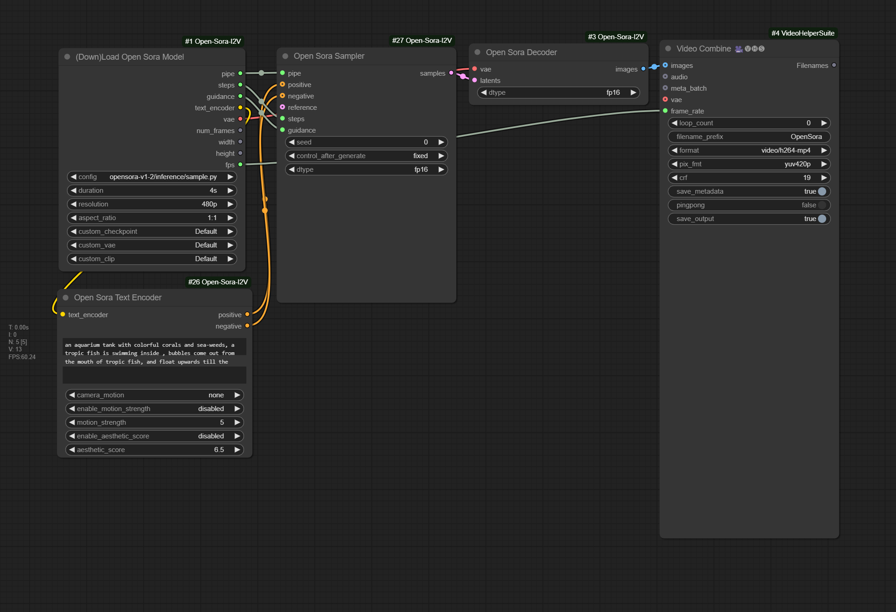
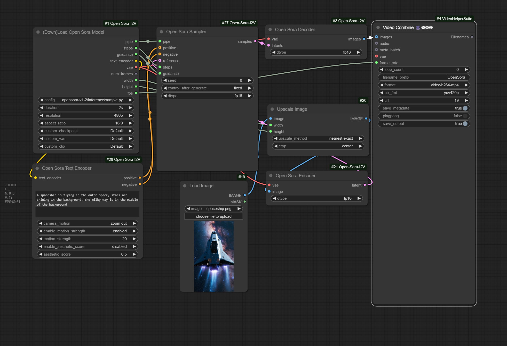

## ComfyUI-Open-Sora-I2V

Another comfy implementation for the short video generation project hpcaitech/Open-Sora, supporting latest V2 and V3 models as well as image to video functions, etc.

## Installation
```
pip install packaging ninja
pip install flash-attn --no-build-isolation

git clone https://www.github.com/nvidia/apex
cd apex
sudo python setup.py install --cuda_ext --cpp_ext

pip3 install -U xformers --index-url https://download.pytorch.org/whl/cu121

cd ComfyUI/custom_nodes
git clone https://github.com/bombax-xiaoice/ComfyUI-Open-Sora-I2V
pip3 install -r ComfyUI-Open-Sora-I2V/requirements.txt
```

If Open Sora standalone mode or `chaojie/ComfyUI-Open-Sora` is used previously, then `opensora` may have been installed as a python package, please uninstall it
```
pip3 list | grep opensora
pip3 uninstall opensora
```

## Models

| Configuration                     | Model Version | VAE Version | Text Encoder Version | Frames | Image Size |
| --------------------------------- | ------------- | ----------- | -------------------- | ------ | ---------- | 
| opensora-v1-2 | [STDiT3](https://huggingface.co/hpcai-tech/OpenSora-STDiT-v3) | [OpenSoraVAE_V1_2](https://huggingface.co/hpcai-tech/OpenSora-VAE-v1.2) | [T5XXL](https://huggingface.co/DeepFloyd/t5-v1_1-xxl) | 2,4,8,16*51 | Many, up to 1280x720 |
| opensora-v1-1 | [STDiT2](https://huggingface.co/hpcai-tech/OpenSora-STDiT-v2-stage3) | [VideoAutoEncoderKL](https://huggingface.co/stabilityai/sd-vae-ft-ema) | [T5XXL](https://huggingface.co/DeepFloyd/t5-v1_1-xxl) | 2,4,8,16*16 | Many |
| opensora | [STDiT](https://huggingface.co/hpcai-tech) | [VideoAutoEncoderKL](https://huggingface.co/stabilityai/sd-vae-ft-ema) | [T5XXL](https://huggingface.co/DeepFloyd/t5-v1_1-xxl) | 16,64 | 512x512,256x256 |
| pixart | [PixArt](https://huggingface.co/PixArt-alpha) | [VideoAutoEncoderKL](https://huggingface.co/stabilityai/sd-vae-ft-ema) | [T5XXL](https://huggingface.co/DeepFloyd/t5-v1_1-xxl) | 1 | 512x512,256x256 |

For `opensora-v1-2` and `opensora-v1-1` as well as VAEs and t5xxl, model files can be automatically downloaded from huggingface, but for older `opensora` and `pixart`, you have to manually download models files to models/checkpoints/ under comfy home directory

## Customized Models

1. Older `opensora` and `pixart` do not support auto download, download them to model/checkpoints/ under comfy home directory and choose this custom_checkpoint

2. Can assign alternative model other than what the configuration defines. For example, download https://huggingface.co/hpcai-tech/OpenSora-STDiT-v2-stage2 instead of the STDiT-v2-stage3

3. If someones had played with Comfy for a while, they have already have similar files in models/vae and models/clip under comfy home directory, such as [vae-ft-ema-560000-ema-pruned](https://huggingface.co/stabilityai/sd-vae-ft-ema-original), t5xxl_fp8_e4m3fn.safetensors or t5xxl_fp16.safetensors

## Text to Video

1. Use Open Sora Text Encoder or whatever comfy t5xxl nodes as the inputs of `positive` and `negative` for Open Sora Sampler, and skip the `reference` input

2. Use OpenSora's default null embedder if the `negative_prompt` is left empty

3. Camera motion, motion strength and aesthetic score may only apply to `opensora-v1-2` (and does not work all the time). One can also put these instructions at the end of `positive_prompt` directly, in format of `f'{positive_prompt}. aesthetic score: {aestheic_score:.1f}. motion score: {motion_sthrenth:.1f}. camera motion: {camera_motion}`

## Image to Video

1. Input one single image (encoded as LATENT) as the starting frame of the output video clip (should align image size). Can skip the inputs `positive` and `negative` for Open Sora Sampler (prompts encoded as CONDITIONGINGs).

2. Or, input two images as the starting and ending frames of the output video clip. These two images should be relevant enough to ensure motion quality. (use Latent Batch from [WAS-Node-Suite](https://github.com/WASasquatch/was-node-suite-comfyui) after each image is encoded as LATENT individually)

3. Or, input multiple images of another video to serve as frame interpolation.

## Text To Video Example

Drag the following image into comfyui, or click Load for custom_nodes/ComfyUI-OpenSora-I2V/t2v-opensora-v1-2-comfy-example.json



Results run under comfy

https://github.com/user-attachments/assets/350cd72b-e7e0-43dd-be97-a978d9d1b500

## Image To Video Example

Drag the following image into comfyui, or click Load for custom_nodes/ComfyUI-OpenSora-I2V/i2v-opensora-v1-2-comfy-example.json



Results run under comfy

https://github.com/user-attachments/assets/0d2ee49c-4d95-4e45-bc7b-a05141ca038e

## Tips

1. fp16 is the recommended dtype for Open Sora Sampler, Encoder and Decoer. One can play around other dtype, but not all combinations work. For instance, Sampler won't work with fp32 under the default flash-attention mode. And, Video Combine node won't accept bf16 images.

2. Reference must share the same width and height as the loaded model is configured. Use Upscale Image or similar nodes to resize before running Open Sora Encoder.

3. One can play with alternative text encoder nodes as the input of `positive` and `negative` to the Open Sora Sampler. In such scenario, one can set `custom_clip` as `Skip` in the Loader to spare unnecessary loading time of the text encoder. 

4. One can also play with alternative vae as the input of Open Sora Encoder and Decoder, but vae can't be skipped as the initializing of checkpoint model has dependencies on vae.

5. The resolution is the shorter edge pixel count under the 16:9 or 9:16 aspect ratio. For example, if you choose 720p, outputs can be 720x1280 or 1280x720. Even more unexpectedly, if you set the aspect ratio to 1:1, the output image size of 720p is 960x960. This is how Open-Sora's original gradio demo works, so I choose to keep it as it is.

6. Setting a lower `motion_strength` (such as 5) can make messy moves and abrupt changes less likely.

7. Had tried my best to minimize code changes under `opensora` directory derived from the original Open Sora project. But utils/inference_utils.py, utils/ckpt_utils.py and a few files under scheduler/ are still modified in order to support comfy features such as seperate text-encoder node, progress bar and preview image, etc.
